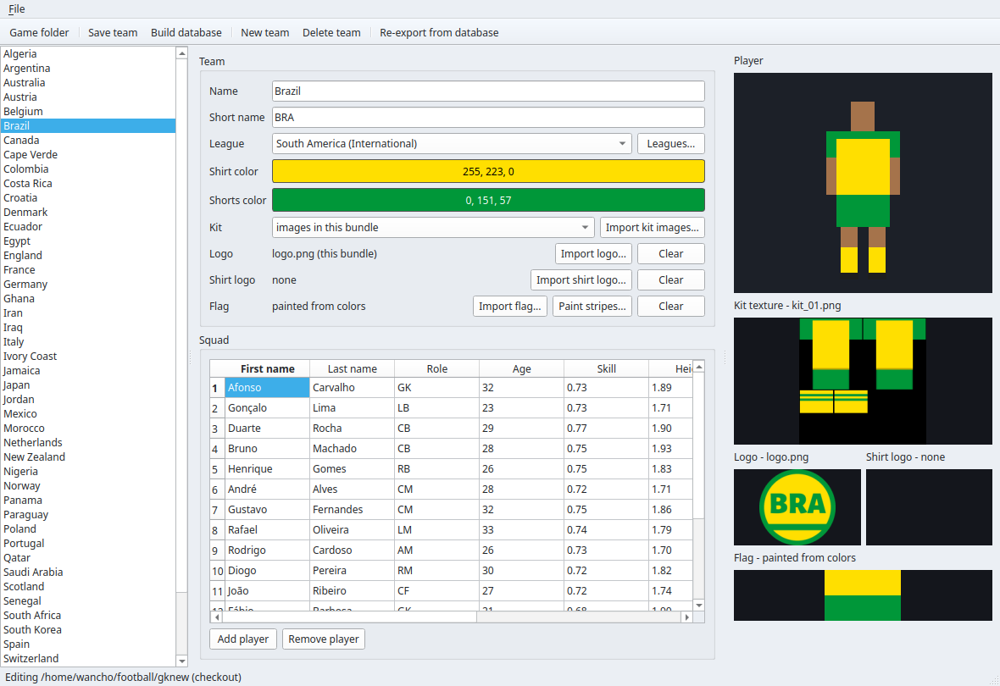
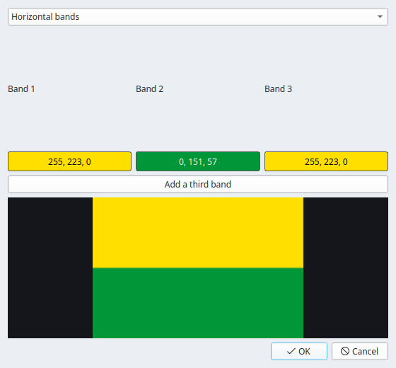

# GoalKick

**A fast arcade football game — cross-platform online 1v1, 48 national teams,
penalty shootouts.** Windows, Linux, Android (macOS and iOS in progress).

> ### ⚠️ This is an ALPHA release
> GoalKick is under active development. Expect rough edges, and expect online
> matches to require **everyone on the same version** — an alpha build only
> plays online against a build from the same release. Things will break and
> change. This is the place to tell us when they do.

## Download

Get the latest build from the [**Releases**](../../releases/latest) page:

| Platform | File | How to run |
|----------|------|------------|
| **Windows** | `goalkick-windows.zip` | Unzip anywhere, run `goalkick.exe`. Nothing to install. |
| **Linux** | `goalkick-linux.tar.gz` | Extract, run `goalkick/goalkick.x86_64`. |
| **macOS** | `goalkick-mac-silicon.dmg` (Apple silicon) / `goalkick-mac-intel.dmg` (Intel) | Open the disk image, drag to Applications. Right-click → Open the first time. |
| **Android** | `goalkick-android.apk` | Enable "install from this source" on first install. |

Because this is an alpha, **online play needs both players on the same
release**. Update all your devices together before playing online.

## Reporting a problem

Open an [**issue**](../../issues/new) here. The most useful bug reports say:

- which platforms were involved (e.g. *Windows host vs Android*),
- what you did and what happened,
- and — for an online match — roughly when it happened, so we can match it to
  the server logs.

---

## Contributing a team

GoalKick's teams are **community-editable**. If your country, club, or a team
you care about is missing (or its kit is wrong), you can add or fix it and open
a pull request. **Approved teams are merged and ship in the next release of the
game.**

You do not need to write any code or build the game. You need the **GoalKick
Editor** and a GitHub account.

### 1. Get the editor

Download the **GoalKick Editor** for your platform from the
[Releases](../../releases/latest) page:

- **Windows** — `GoalKickEditor-windows-x86_64.exe`
- **Linux** — `GoalKickEditor-linux-x86_64` (`chmod +x` it first)
- **macOS** — `GoalKickEditor-macos-arm64.zip` (Apple silicon; unzip, right-click → Open the first time)

It is a standalone app: no Python, no installation.

### 2. Make the team

Clone or download this repo first so the editor has teams to work with. Then:

1. **Point the editor at the `data/` folder.** Click **Game folder** (top left)
   and choose the `data/` directory of your checkout. The team list fills in on
   the left; pick one to edit it, or **New team** to start fresh.
2. **Fill in the team form** (middle column):
   - **Name**, **short name** (3 letters), and **League** (the zone it plays in).
   - **Shirt colour** and **Shorts colour** — click a colour bar to change it.
     The editor draws both kits from these; the kit preview is on the right.
   - **Kit** — leave it drawing from the colours, or **Import kit images…** to
     supply your own `kit_01.png` / `kit_02.png`.
   - **Logo** — **Import logo…** to set the crest (shown bottom-right).
   - **Shirt logo** — optional: **Import shirt logo…** with a transparent PNG
     and it is composited onto the shirt's chest.
   - **Flag** — **Import flag…** for a PNG, or **Paint stripes…** to draw one
     (see below). National flags should be painted, not copied — a flag's
     design is free, a particular image of it may not be.
3. **Build the squad** in the table at the bottom: **Add player**, then set each
   name, **Role** (GK/DF/MF/FW positions), **Age**, **Skill** (0–1), height.
   Aim for 16+ players. You can start from an existing team and edit.
4. **Save team**, and — if you want to see it in a local build — **Build
   database** compiles every bundle into the game's database.

Every team is one folder of plain text and images under `data/teams/<slug>/`;
the editor is just the friendly way to write it. Open one of the existing teams
in the list to see the shape.

#### The flag painter

**Paint stripes…** opens the flag painter. Choose a **layout** (horizontal or
vertical bands, and more), set each band's colour, and the preview updates live.
It writes an original 120×80 rendering — which is exactly what keeps national
flags safe to ship. Click **OK** to attach it to the team.

### 3. Open a pull request

Fork this repo, drop your `data/teams/<slug>/` folder in, and open a PR. Tell
us in the description what you added and, if the team is real, where the crest
and kit designs came from (see **Legal** below). A maintainer reviews it, and
once merged it goes into the next game release — you'll see it in the download.

### Legal — please read before contributing art

We can only accept teams whose artwork is safe to ship. **Do not upload
copyrighted club crests, sponsor logos, or official kit designs you do not have
the right to distribute.** Real clubs' badges and kit graphics are trademarked.

What is safe:

- **National flags** — a flag's *design* is not anyone's private property; a
  particular drawing of it can be, so draw your own (the editor's flag painter
  produces original renderings). The shipped 48 national flags are drawn from
  each flag's public geometry for exactly this reason.
- **Original crests and kits** you designed yourself, or artwork explicitly
  released under a permissive/open licence (say which, in the PR).
- **Names and squads** — player and team names are facts, not artwork.

What is not:

- A real club's badge, wordmark, or sponsor logos.
- A scan or trace of an official kit.
- Anything you found online without a licence that permits redistribution.

If in doubt, make an original crest in the editor — a distinctive mark in the
team's colours reads as that team in-game, and it is unambiguously yours to
give. By opening a PR you confirm the artwork is yours to contribute, and that you
grant the project the right to include it in GoalKick's releases.

---

## What GoalKick is

A modern port of a deterministic football simulation to the Godot engine, with
a C++ core. The same simulation runs bit-identically on every platform, which
is what makes cross-platform online lockstep possible. The game, the team
editor, and the master server are developed by David Zambrano and Juan Fajardo,
supported by [BitPointer](https://bitpointer.co). Learn more at
[goalkick.co](https://goalkick.co).
